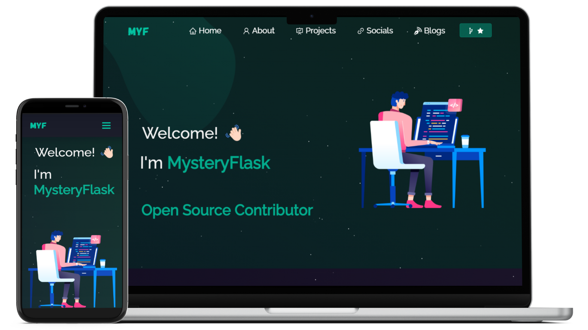

<h2 align="center">
  Portfolio Website - v1.0 
  <a href="https://mysteryportfolio.vercel.app" target="_blank">Website in Progress</a>
</h2>

  

 

 &nbsp;

## Credit

Credit to [Soumyajit4419](https://github.com/soumyajit4419/) for building the base template of this project.

## Built With

My personal portfolio <a href="https://mysteryportfolio.vercel.app" target="_blank">in progress</a> which features some of my projects as well as my technical skills. 

This project was built using these technologies.

- React.js
- Node.js
- Express.js
- CSS3
- VsCode
- Vercel
